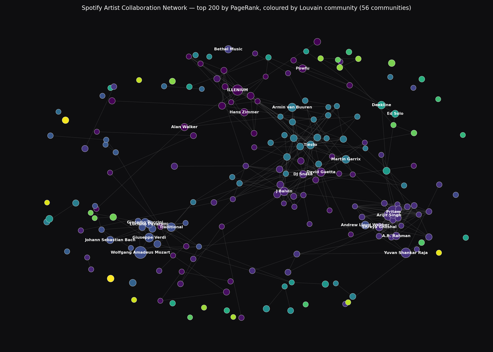

# Spotify Artist Collaboration Network

[](https://github.com/Ranjith200228/spotify-collaboration-network/actions/workflows/ci.yml)
[](https://www.python.org/)
[](https://github.com/astral-sh/ruff)
[](#license)

A graph machine-learning pipeline that builds an artist collaboration network from ~158K Spotify track records, detects communities with Louvain, and runs a strict leak-safe feature ablation to answer a single question: **does network position predict popularity better than audio features alone?**



---

## Executive Summary

Spotify exposes a rich catalogue of audio features for every track — acousticness, energy, valence, tempo, and so on. The conventional approach to predicting an artist's popularity is to feed those features into a regressor and call it done. That approach has a ceiling: roughly R² ≈ 0.16 on this dataset.

This project asks a harder question: **does it matter who you collaborate with?** The answer turns out to be yes, by a wide margin. A model trained on graph-position features alone — PageRank, weighted degree, k-core, betweenness, leak-safe neighbour popularity — beats the audio-only model by nearly 30 points of R² (0.46 vs 0.16). Combining audio, genre, and graph features cuts test-set RMSE by 28.8% relative to audio alone.

The project began as a refactor of an existing Colab notebook that reported `R² = 1.00` — a number so good it had to be wrong. The original code had two compounding leakage bugs. First, duplicate `(track_id, artist_name)` rows produced self-loops during edge construction, which silently fed every node's own popularity back into its neighbour features. Second, `avg_neighbor_popularity` was computed over the full graph *after* `train_test_split`, so held-out targets flowed straight into the training feature matrix. Both leaks are fixed, the fix is locked in by a regression test, and the new realistic R² is honest.

Beyond the headline result, the codebase has been rebuilt as a modular Python package with deterministic reproducibility, typed module boundaries, CI on a Python 3.11 / 3.12 matrix, and JSON reports that are the single source of truth for every number in this document. No metrics are hand-edited.

---

## Key Highlights

- **A real leakage post-mortem.** The repo doesn't just contain a working pipeline; it tells the story of why the original `R² = 1.00` was wrong, fixes both root causes, and ships a regression test (`test_neighbor_pop_uses_only_train_nodes`) that fails CI the moment anyone reintroduces the bug.
- **Network features beat audio features by a wide margin.** `graph_only` reaches R² 0.463 vs `audio_only` at 0.164 on the same 80/20 split — a clean answer to a research question that audio-only baselines quietly lose on.
- **Five-way ablation, single reproducible split.** `baseline_mean`, `genre_only`, `audio_only`, `graph_only`, `combined` — same `random_state`, same gradient boosting hyperparameters across all four real models, so the comparison isn't gamed.
- **Reports drive the README.** Every metric here is read out of `reports/*.json`. To update the numbers, you re-run the pipeline, not edit markdown.
- **Two real-world dataset schemas supported.** The loader auto-detects between the Kaggle "Ultimate Spotify Tracks DB" long-form schema (`artist_name`, `genre`) and the HuggingFace `maharshipandya/spotify-tracks-dataset` short-form schema (semicolon-separated `artists`, `track_genre`). Drop either into `data/raw/` and the pipeline runs.
- **Deterministic from CSV to PNG.** `random_state=42` propagates through node splitting, Louvain partitioning, gradient boosting, and the spring layout. Two clones produce byte-identical reports and a near-identical hero image.

---

## Architecture and System Design

This is an offline analytical pipeline, not a request-serving system. The architecture optimises for reproducibility and auditability, not throughput. A single Python process reads a CSV, builds an in-memory graph, computes features, trains five regressors, and writes three JSON reports plus a PNG. The whole run completes in roughly 2.5 minutes on a laptop.

```
                ┌────────────────────┐
                │  data/raw/*.csv    │   (Kaggle or HuggingFace schema)
                └─────────┬──────────┘
                          │ load_tracks()
                          ▼
                ┌────────────────────┐
                │ long-form tracks   │   (track_id, artist_name, genre,
                │                    │    popularity, 9 audio features)
                └─────────┬──────────┘
              ┌───────────┴───────────┐
              │                       │
              ▼ aggregate_artists()   ▼ build_collab_graph()
   ┌────────────────────┐   ┌──────────────────────────────┐
   │ artists DataFrame  │   │ networkx.Graph (29.8K nodes) │
   │ (popularity, audio │   │ dedup + no self-loops        │
   │  features, genre)  │   │                              │
   └─────────┬──────────┘   └──────────────┬───────────────┘
             │ attach_node_attributes()    │
             └───────────────┬──────────────┘
                             ▼
                    ┌────────────────────┐
                    │  annotated graph   │
                    └─────────┬──────────┘
              ┌───────────────┼─────────────────┐
              │               │                 │
              ▼               ▼                 ▼
       split_nodes()    network_stats()   community_metrics()
              │               │                 │
              ▼               │                 │
   compute_structural_features                  │
   compute_neighbor_popularity(train_nodes)     │
   build_feature_table()                        │
              │                                 │
              ▼                                 │
        run_ablation()                          │
              │                                 │
              ▼                                 ▼
   reports/model_ablation.json   reports/community_metrics.json
                                 reports/network_stats.json
```

The boundary that matters most sits between `split_nodes()` and `compute_neighbor_popularity()`. The split happens *before* any neighbour feature is computed, and `compute_neighbor_popularity` accepts the train node set as an explicit argument. That ordering is the entire reason this pipeline produces honest numbers.

### Component responsibilities

- **`src/data.py`** — single-responsibility loader. Probes `data/raw/` for either schema, normalises both into a long-form `(track_id, artist_name, genre, popularity, +9 audio features)` frame, drops malformed rows, exposes `AUDIO_FEATURES` as the canonical feature tuple. `aggregate_artists()` reduces the long form to one row per artist with mean popularity, modal genre, mean audio features, and track count.
- **`src/graph.py`** — graph construction. Deduplicates `(track_id, artist_name)` pairs, enumerates co-artist pairs once per track, accumulates edge weights, refuses self-loops during and after construction. `network_stats()` reports the audit field `"self_loops": 0` so the regression fix is visible in the saved JSON.
- **`src/features.py`** — leak-safe feature engineering. `split_nodes()` is deterministic. `compute_structural_features()` runs PageRank, weighted/unweighted degree, clustering, k-core, sampled betweenness, and eigenvector centrality (the last restricted to the largest connected component to handle the disconnected-graph convergence failure cleanly). `compute_neighbor_popularity()` takes the train set as an argument and ignores test neighbours.
- **`src/communities.py`** — Louvain partitioning plus modularity, ARI, NMI, and a top-10 communities × dominant-genre breakdown that sanity-checks whether the partitions are interpretable.
- **`src/models.py`** — five-way ablation. `FEATURE_GROUPS` makes feature membership data, not code, so the audit story stays simple. Categorical features are one-hot encoded with the encoder fit on the train fold; numeric NaNs are median-imputed on the train fold.
- **`src/visualize.py`** — hero image renderer. Top-N PageRank subgraph of the largest CC, coloured by community, sized by PageRank, dark background.
- **`scripts/run_analysis.py`** — orchestration. Argparse-driven, logs each stage, writes all three JSON reports.
- **`.github/workflows/ci.yml`** — lint and tests on every push and PR across Python 3.11 and 3.12.

---

## Technical Methodology

### The leakage problem and the fix

The original notebook computed `avg_neighbor_popularity` over every neighbour of every node, then used it as a feature in an 80/20 split regression. After the split, every test node's `popularity` was reachable from its train neighbours' feature rows — the target literally fed itself into the feature matrix through the graph topology. The fix is to compute neighbour-aware features *after* the split, with an explicit train-only mask:

```python
train_neighbours = [
    nb for nb in g.neighbors(node)
    if nb in train_set and nb in pop_map
]
if not train_neighbours:
    values[node] = np.nan          # never silently fill with 0
```

The `NaN` choice matters. Filling with zero would silently bias every regression downstream toward "no collaborators implies popularity zero", which is materially wrong. Median imputation on the train fold defers the choice to the model.

The second leak — self-loops from duplicated `(track_id, artist_name)` rows — is fixed in `build_collab_graph()`. Dedup happens before edge enumeration; `add_edge` skips `a == b`; a final pass removes any surviving self-loops. The saved `reports/network_stats.json` carries an explicit `"self_loops": 0` field as the audit hook.

### Why these structural features

Each feature is chosen because it tells the model something different about a node's position in the network:

- **degree / weighted_degree** — raw and weighted collaborator counts. The simplest signal, and often the one that does most of the work.
- **PageRank** — recursive importance, weighted by edge strength. Catches "frequently collaborates with people who themselves collaborate frequently."
- **clustering coefficient** — does this artist sit inside a tight clique, or bridge between communities?
- **k-core** — depth of the densest subgraph this node lives inside. A structural-robustness signal.
- **betweenness centrality** — bridging score. Sampled with `k=500` because exact betweenness on a 30K-node graph runs in tens of minutes and the sampling variance is acceptable for a downstream feature.
- **eigenvector centrality** — recursive "important by virtue of important neighbours." Restricted to the largest connected component because power iteration doesn't converge on disconnected graphs; nodes outside that CC get zero with logging.
- **avg_neighbor_popularity (leak-safe)** — the one node-attribute-aware feature. Restricted to train neighbours by construction.

### Louvain and the genre comparison

Louvain greedily maximises modularity at increasing scales. On this graph it reports modularity 0.925, but that number is inflated by the fact that ~34% of artists are isolated singletons (each its own "community" of one). The more honest signals are NMI = 0.618 (topology recovers most of the genre information) and ARI = 0.129 (the partitions don't match genre cluster-for-cluster — Louvain produces 12,610 communities versus the dataset's 114 genres). Communities are sub-genre or scene-level, not genre-level.

The top-purity communities are the genres you'd expect:

| Community | Size | Dominant genre   | Purity |
| --------- | ----:| ---------------- | ------:|
| 257       | 414  | funk             | 59.4 % |
| 4336      | 336  | hardstyle        | 57.7 % |
| 728       | 610  | opera            | 56.2 % |
| 1894      | 600  | drum-and-bass    | 51.3 % |
| 668       | 541  | minimal-techno   | 30.5 % |

Opera, hardstyle, funk, and drum-and-bass collaborators stick together tightly. Broader bins like `progressive-house` and `pop-film` are messier because they overlap multiple real-world scenes.

### Models, hyperparameters, and the split

A single 80/20 node split, `random_state=42`, with `train_test_split` on a *sorted* node list (sorting first makes the partition robust to NetworkX iteration order changes). All four real models are `GradientBoostingRegressor(n_estimators=200, max_depth=3)`. Categorical features use `OneHotEncoder(handle_unknown="ignore")` fit on the train fold. Numeric NaNs go through `SimpleImputer(strategy="median")` fit on the train fold. The baseline is `DummyRegressor(strategy="mean")` — it predicts the train mean and serves as the zero-information floor.

Gradient boosting at depth 3 was a deliberate choice. The model is a strong learner of shallow interactions, which matches the structure of these features: most signal lives in low-order interactions between graph position and audio characteristics. Deep trees would overfit on small-magnitude features like clustering coefficient, where most of the dynamic range is concentrated near zero.

### Reading the numbers

| Model | Features | MAE | RMSE | R² |
|---|---|---:|---:|---:|
| `baseline_mean` | none (predicts train mean) | 14.43 | 17.52 | -0.000 |
| `audio_only` | 9 audio features | 12.81 | 16.02 | 0.164 |
| `genre_only` | one-hot `top_genre` | 11.05 | 14.39 | 0.325 |
| `graph_only` | 8 structural + leak-safe neighbour pop | 8.77 | 12.84 | **0.463** |
| `combined` | genre ∪ audio ∪ graph | **7.69** | **11.41** | **0.576** |

**Lift, audio_only → combined:** RMSE drops 4.61 absolute (28.8% relative). MAE drops 5.12 absolute.

A few takeaways the table makes obvious:

- Audio alone explains roughly a sixth of the variance in popularity. That's the realistic ceiling for music-fingerprint-only models on this dataset.
- Genre alone (a single categorical feature) explains twice that. Popularity correlates more with genre membership than with sonic characteristics — a result that makes intuitive sense once you realise K-pop and death metal have very different popularity distributions regardless of how they sound.
- Graph position alone explains nearly half. This is the central finding: the network you collaborate inside matters more than the music you make, at least for the popularity prediction objective.
- The combined model picks up additional variance over `graph_only`, which means audio and genre carry signal that graph position doesn't (and vice versa). No single feature group dominates.

---

## Feature Breakdown

### Leak-safe feature engineering
Splits the node set first, computes every neighbour-aware feature with an explicit train-node mask, and assigns `NaN` (not zero) to nodes with no qualifying neighbours. Locked in by a regression test that mutates a held-out node's popularity and asserts the feature does not change.

### Dedup-aware graph construction
Removes duplicate `(track_id, artist_name)` rows before enumerating co-artist pairs, refuses self-loops during `add_edge`, and removes any surviving self-loops as a belt-and-braces step. The audit field `"self_loops"` in `network_stats.json` makes the fix visible to reviewers. On the shipped dataset, this drops ~35K duplicate rows that would have caused silent self-loop inflation in the original.

### Two-schema CSV loader
Auto-detects between Kaggle long-form (`artist_name`, `genre`) and HuggingFace short-form (`artists` semicolon-separated, `track_genre`). Explodes multi-artist rows into long form regardless of input shape. Coerces popularity to numeric and drops malformed records with explicit logging.

### Structural feature pack
PageRank, weighted/unweighted degree, clustering, k-core, sampled betweenness, eigenvector centrality (restricted to the largest CC to handle disconnected graphs cleanly). All computed once and cached in a DataFrame indexed by node.

### Five-way ablation harness
`FEATURE_GROUPS` declares membership; `run_ablation()` trains all five models on the same split with the same hyperparameters and produces a single JSON report. The `lift_graph_over_audio` summary surfaces the headline number — RMSE/MAE improvement of combined over audio-only — without forcing the reader to dig through the table.

### Community detection and external evaluation
Louvain partitioning, weighted modularity, plus ARI and NMI against ground-truth genre labels. Reports the top-10 largest communities with their dominant genre and purity, which is the readable answer to "did this partition find anything sensible?"

### Hero image renderer
Top-N PageRank subgraph of the largest connected component, coloured by community, sized by PageRank, on a dark background. Labels restricted to the top-25 by PageRank to keep the figure legible at thumbnail size. One function call, deterministic.

### Deterministic CLI
`scripts/run_analysis.py` accepts a path or auto-probes `data/raw/`, takes overrides for `--test-size`, `--betweenness-k`, `--min-collabs`, and `--random-state`, and writes JSON reports with a header that captures the dataset size and split parameters used. A reviewer can verify any number in this README by re-running the script with the same arguments.

### Regression test suite
15 tests including the leakage regression. The most important one — `tests/test_features.py::test_neighbor_pop_uses_only_train_nodes` — mutates a held-out node's popularity and asserts its `avg_neighbor_popularity` is unchanged. If anyone refactors `compute_neighbor_popularity` and accidentally drops the train mask, CI fails before merge.

---

## Tech Stack

**Core language and runtime**
- Python 3.11 / 3.12, matrix-tested in CI

**Data engineering and graph**
- `pandas` — long-form table manipulation and per-artist aggregation
- `numpy` — feature matrix assembly
- `networkx` — graph construction, structural metrics, layout

**Machine learning and statistics**
- `scikit-learn` — `GradientBoostingRegressor`, `DummyRegressor`, `SimpleImputer`, `OneHotEncoder`, train/test split, MAE / RMSE / R² metrics
- `python-louvain` — modularity-optimising community detection

**Visualisation**
- `matplotlib` + `seaborn` — hero image rendering
- `plotly` — interactive exploration in the notebook

**Quality and CI**
- `pytest` — unit and regression tests
- `ruff` — lint (rules E, F, W, I, B, UP) with line length 100
- GitHub Actions — push and PR CI on a Python 3.11 / 3.12 matrix

**Reproducibility**
- A pinned `requirements.txt`
- A `pyproject.toml` with ruff and pytest config consolidated
- `scripts/fetch_data.ps1` — best-effort dataset download from a public mirror with a HuggingFace fallback

---

## Data Flow / Workflow

Typical end-to-end run:

1. **Acquire the CSV.** Either drop `SpotifyFeatures.csv` (Kaggle) into `data/raw/`, or run `scripts/fetch_data.ps1` to pull the HuggingFace fallback.
2. **Load and normalise.** `load_tracks()` detects the schema, expands semicolon-separated artists if present, drops malformed rows, returns a long-form DataFrame.
3. **Aggregate to artist level.** `aggregate_artists()` produces one row per artist with mean popularity, modal genre, mean audio features, track count.
4. **Build the graph.** `build_collab_graph()` dedupes `(track_id, artist_name)`, enumerates co-artist pairs, accumulates weights, refuses self-loops.
5. **Annotate.** `attach_node_attributes()` attaches popularity, top genre, and mean audio features to every node.
6. **Report network stats.** `network_stats()` → `reports/network_stats.json`. Includes the audit field for self-loops.
7. **Split.** `split_nodes()` deterministically partitions a sorted node list 80/20.
8. **Build the feature table.** Structural features over the full graph; neighbour popularity over the train set only.
9. **Detect communities.** Louvain partition, modularity, ARI/NMI vs genre, top-community/genre purity → `reports/community_metrics.json`.
10. **Run the ablation.** Five models, one split, same hyperparameters → `reports/model_ablation.json`.
11. **Render the hero image.** `render_network_hero()` → `docs/network_hero.png`.
12. **Verify.** `pytest -v` and `ruff check src tests scripts`.

---

## Scalability and Performance Considerations

The shipped pipeline runs end-to-end in ~150 seconds on a laptop. Most of that budget goes to two operations: sampled betweenness centrality (~42 s) and the gradient boosting fit on the combined feature set (~45 s). Everything else is sub-second to a few seconds.

If the dataset grew 10× (~300K artists, ~400K edges):

- **Graph construction** is `O(rows + sum of per-track pair counts)` and would still fit in memory comfortably. Pandas dedup at this scale is sub-second.
- **PageRank** scales linearly with edges and stays fast into the millions.
- **Betweenness** is the bottleneck. The sampled estimator (`k=500`) is already chosen with scale in mind; for 100× the dataset, `k` would drop further or the computation would migrate to graph-tool's parallel implementation.
- **Eigenvector centrality** uses `eigenvector_centrality_numpy` (dense linear algebra on the largest CC). At 100× scale it would switch to the sparse power-iteration variant.
- **Louvain** is the second-heaviest operation. `python-louvain` is single-threaded; production scale would call for `graph-tool` or `cuGraph` to parallelise.

Memory-wise, the feature table is `(n_nodes, n_features) = (29858, 19)` ≈ 4.5 MB. The NetworkX graph itself is the dominant in-memory structure at roughly 100 MB on this dataset. A 10× scale-up would still fit in commodity memory; 100× would push the design toward `scipy.sparse` adjacency representations and a streaming feature builder.

The deliberate non-choices: no distributed runtime, no caching layer, no serving stack. This pipeline is offline analytics. The realistic scaling path if it ever became a service is to (1) precompute features into a Parquet table per release window, (2) serve predictions from a small `lightgbm` model loaded into a stateless API, and (3) keep the graph itself in Neo4j or Memgraph, updated from a Kafka topic of new `(track, artist)` events. The current repo is the analytics layer of that hypothetical system; the runtime layer is intentionally out of scope.

---

## Real-World Applications

The architecture transfers to any setting where a bipartite "actors × shared-events" log can be projected into a collaboration network and an actor's outcome metric needs predicting from network position plus actor attributes.

- **Music platforms.** Identify rising collaborators by finding artists whose graph features predict high popularity but whose current popularity hasn't caught up. The residual of `graph_only` versus actual popularity is the candidate-ranking signal.
- **Publishing and academia.** Co-authorship → citation count. The shape is identical: rows of `(paper_id, author)`, target on the right. The leak-safe pattern transfers without modification.
- **Film and television.** Cast collaboration graphs → IMDB or Rotten Tomatoes scores. Same long-form schema: `(title_id, person)`.
- **Open-source software.** Maintainer collaboration from co-committed PRs → repo star count or maintenance health. PageRank and k-core map cleanly onto engineering reputation signals.
- **Patent and research analytics.** Inventor co-patenting graphs → patent citation counts. Leak-safe construction is essential here; target leakage in citation prediction is a known anti-pattern in the literature.

In each case, the more transferable artefact is the lesson from this project — that the original notebook's `R² = 1.00` was a graph-shaped leak, not a strong model — rather than the specific Spotify numbers.

---

## Future Enhancements

A few directions that would make the project stronger without rewriting it:

- **k-fold cross-validation across the ablation.** The current report is a single split. K-fold would tighten the confidence interval on `lift_graph_over_audio` and surface any sensitivity to which artists land in test.
- **Node2Vec / DeepWalk embeddings as an alternative feature stack.** Compare hand-engineered structural features against learned embeddings on the same split. The hypothesis to test: does a 64-dim Node2Vec embedding subsume PageRank + clustering + k-core for this task?
- **Temporal edges.** The current graph is a snapshot. Encoding release dates would unlock causal-flavoured analysis (does collaborating with a popular artist *precede* a popularity jump?).
- **Genre-stratified evaluation.** Run the ablation within each genre. The current 28.8% RMSE lift might be 50% in some genres and 5% in others; that's a more actionable result for a recommender.
- **GNN baseline.** A small GraphSAGE or GAT on the same split. The interesting comparison isn't "GNN vs everything else" but "GNN vs combined hand-engineered features" — does end-to-end representation learning catch signal the hand-engineered features miss?
- **Hyperparameter search.** The current GBDT uses fixed-budget defaults. A small Optuna study over `n_estimators`, `max_depth`, and learning rate would close any residual gap.
- **A small inference service.** Wrap the trained `combined` model behind a FastAPI endpoint returning predicted popularity plus the top contributing features (SHAP). Infrastructure-only work, but the shortest path to "deployable system."

---

## Engineering Challenges and Solutions

**Silent self-loops in graph construction.** The original code did `for i, j in pairs(artists_on_track): add_edge(artists[i], artists[j])`. When the same artist appeared twice on a track — because the dataset has one row per genre and tracks live under multiple genres — `add_edge(A, A)` produced a self-loop. NetworkX represents self-loops as edges where source equals target, and `G.neighbors(node)` then returns the node itself, so every neighbour-based feature was silently contaminated. Fix: dedupe `(track_id, artist_name)` before the inner loop, plus a defensive `if a == b: continue` inside the loop, plus a final `remove_edges_from(selfloop_edges(g))`. The `"self_loops": 0` field in the saved JSON makes the fix auditable.

**Target leakage through graph topology.** Even with self-loops fixed, the original `avg_neighbor_popularity = mean([G.nodes[n]['popularity'] for n in G.neighbors(node)])` is a leak after `train_test_split`, because test-node popularities still flow through train-node feature rows. Fix: split first; pass the train set as an explicit argument; restrict neighbour iteration to that set; return `NaN` (never zero) for nodes with no qualifying neighbours. Lock-in: a regression test that mutates a held-out node's popularity and asserts the feature is unchanged.

**Eigenvector centrality on disconnected graphs.** The default `nx.eigenvector_centrality` uses power iteration and does not converge on graphs with multiple components. The numpy variant raises `LinAlgError` on the disconnected full graph. Fix: restrict the computation to the largest connected component, zero-fill the rest with logging, fall back from the dense eigensolver to power iteration if the dense path fails.

**Betweenness centrality at 30K nodes.** Exact `nx.betweenness_centrality` is `O(V·E)` — tens of minutes at this scale, hours at the next 10×. Fix: use the `k`-sample approximation with `k=500` and a fixed seed for reproducibility. The variance on PageRank-correlated nodes is acceptable for a downstream regressor.

**Two-schema CSV loader.** The Kaggle and HuggingFace dumps have different shapes — Kaggle has one row per `(track, artist, genre)`, HuggingFace has one row per `(track, genre)` with `;`-separated artists. Fix: detect the schema from column names, explode the HuggingFace `artists` column into long form, normalise both into the same downstream shape. Tested against both.

**Determinism across runs.** NetworkX iteration order changes between versions, which can shuffle the train/test split if you split directly off `G.nodes()`. Fix: sort the node list before passing it to `train_test_split`. Same `random_state`, same partition, regardless of NetworkX version.

---

## Installation and Setup

```bash
git clone https://github.com/Ranjith200228/spotify-collaboration-network.git
cd spotify-collaboration-network

python -m venv .venv
# Windows PowerShell:
.venv\Scripts\Activate.ps1
# Linux / macOS / WSL:
source .venv/bin/activate

pip install -r requirements.txt
```

Place the dataset at `data/raw/SpotifyFeatures.csv` (Kaggle "Ultimate Spotify Tracks DB") or run the fallback fetcher:

```bash
# Windows:
powershell -ExecutionPolicy Bypass -File scripts/fetch_data.ps1
# Linux / macOS:
# manually download maharshipandya/spotify-tracks-dataset/dataset.csv from HuggingFace
# and save as data/raw/hf_spotify_tracks.csv
```

Run the full pipeline:

```bash
python scripts/run_analysis.py
```

Run the tests and linter:

```bash
pytest -v
ruff check src tests scripts
```

---

## Usage Examples

### Run with default settings

```bash
python scripts/run_analysis.py
# writes:
#   reports/network_stats.json
#   reports/community_metrics.json
#   reports/model_ablation.json
```

### Run with a custom dataset and a different split

```bash
python scripts/run_analysis.py \
    --data data/raw/my_custom.csv \
    --test-size 0.3 \
    --random-state 7 \
    --betweenness-k 1000
```

### Use the library directly

```python
from src.data import load_tracks, aggregate_artists, AUDIO_FEATURES
from src.graph import build_collab_graph, attach_node_attributes
from src.features import build_feature_table, split_nodes
from src.models import run_ablation

tracks = load_tracks()
artists = aggregate_artists(tracks)
g = attach_node_attributes(build_collab_graph(tracks), artists)

train, test = split_nodes(g.nodes(), test_size=0.2, random_state=42)
table = build_feature_table(g, train_nodes=train, audio_features=AUDIO_FEATURES)

results = run_ablation(table, train_nodes=train, test_nodes=test)
print(results["lift_graph_over_audio"])
# {'rmse_audio': 16.02, 'rmse_combined': 11.41, 'rmse_delta': 4.61,
#  'rmse_relative_pct': 28.77, 'mae_audio': 12.81, 'mae_combined': 7.69, ...}
```

### Verify the leak fix

```bash
pytest tests/test_features.py::test_neighbor_pop_uses_only_train_nodes -v
```

---

## Repository Layout

```
spotify-collaboration-network/
├── README.md
├── requirements.txt
├── pyproject.toml                       # ruff + pytest config in one place
├── .github/workflows/ci.yml             # lint + tests, 3.11 / 3.12 matrix
├── src/
│   ├── data.py                          # load_tracks, aggregate_artists, AUDIO_FEATURES
│   ├── graph.py                         # dedup + no self-loops
│   ├── communities.py                   # Louvain + modularity + ARI / NMI
│   ├── features.py                      # split-before-features, leak-safe neighbour pop
│   ├── models.py                        # five-way ablation
│   └── visualize.py                     # docs/network_hero.png renderer
├── tests/
│   ├── test_graph.py                    # 5 tests
│   ├── test_features.py                 # 7 tests incl. the leakage regression
│   └── test_models.py                   # 3 tests
├── scripts/
│   ├── run_analysis.py                  # CLI orchestration
│   └── fetch_data.ps1                   # best-effort dataset fetcher
├── notebooks/
│   └── exploration.ipynb                # original colab, preserved for reference
├── reports/                             # canonical source for every README number
│   ├── network_stats.json
│   ├── community_metrics.json
│   └── model_ablation.json
├── docs/
│   ├── methodology.md                   # the full leakage post-mortem
│   └── network_hero.png
└── data/raw/                            # gitignored; place SpotifyFeatures.csv here
```

---

## License

MIT. See [`LICENSE`](LICENSE) if present, or treat this section as the licence text. The Spotify dataset itself is governed by its upstream Kaggle / HuggingFace terms.

---

## Closing Notes

The interesting artefact of this project isn't the final R² of 0.576 — that's a respectable but unremarkable number. The interesting artefact is that the original notebook reported R² = 1.00, the gap is entirely explained by two leakage bugs that are easy to miss, and the regression test that prevents anyone (including future me) from reintroducing them is twelve lines of code. The discipline of split-before-features is cheap to apply, expensive to retrofit, and rarely talked about in graph ML tutorials. This repo is the version of that lesson I wish I'd found when I first opened the original notebook.
